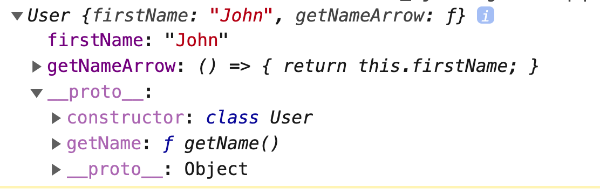

# "Arrow functions" Cookbook

Стрелочные функции появились с приходом ES6 (ECMAScript 2015) и их появление обусловлено от части желанием JS разработчиков писать меньше кода, а если точнее, не писать длинные выражения анонимных функций в колбэках, да и не только в колбэках:

Пример без использования "arrow function"

```javascript
const result = [1, 2, 3].map(function (item) {
  return item * 2;
});

console.log(result); // [3, 4, 6]
```

C использованием "arrow function" пример выше может выглядеть следующим образом:

```javascript
const result = [1, 2, 3].map(item => item * 2);
```

Код стал более компактным за счет того что мы избавились от :

* круглых скобок вокруг единственного аргумента функции (при использовании более одного аргумента, скобки обязательны)
* фигурных скобок вокруг тела функции
* ключевого слова `function`
* ключевого слова `return`

Эти синтаксические особенности также позволяют использовать вот такую короткую запись:

```javascript
const sum = a => b => c => a + b + c;
```

Код, приведенный выше, эквивалентен записи с использованием "function":

```javascript
function sum (a) {
  return function (b) {
    return function (c) {
      return a + b + c;
    }
  }
}
```

Согласитесь, мы сэкономили порядочное количество строк кода.

Кроме компактности и лаконичности, которые дает использование "arrow function", разработчики нового стандарта наделили данный тип функций рядом дополнительных особенностей:

## "Arrow function" не имеет своего собственного `this`

```javascript
const someArrowFunction = () => {
  console.log(this);
}

someArrowFunction() // window
```

В примере выше мы не используем директиву `use strict`, поэтому  вызов "arrow function" в глобальной области дает ожидаемый результат - значение `window` (условимся что мы запускаем код в браузере, для другой среды выполнения это значение может быть иным).

А что если "arrow function" будет использоваться как метод объекта? Давайте сравним ее  поведение с обычной функцией:

```javascript
const user = {
  firstName: 'John',
  getNameArrow: () => {
    return this.firstName;
  },
  getName() {
    return this.firstName;
  } 
};

console.log(user.getNameArrow()); // undefined
console.log(user.getName()); // "John"
```

Вызов метода `getName`, как и предполагалось, вернул нам ожидаемый результат - "John", значение которое содержится в свойстве объекта `firstName`.

А вот вызов метода `getNameArrow` вернул `undefined` - не совсем то что мы бы хотели получить. Хотя, естественно, такое поведение является абсолютно корректным.

Все дело как раз таки в том что у "arrow function" отсутствует собственный `this`, а используется значение `this` окружающего контекста, или другими словами родительского лексического окружения (LexicalEnvironment).

Чем же такая особенность может быть полезной? Давайте немного модифицируем наш пример:

* добавим в `user` массив со списком друзей и метод который позволит сказать "hi" каждому другу;
* откажемся от "arrow function" и используем обычную функцию в методе `forEach`

```javascript
const user = {
  firstName: 'John',
  friends: ['Peter', 'Kevin', 'Nick'],
  seyHi() {
    this.friends.forEach(function (friend) {
      console.log(this.firstName + ' says hi 👋 to ', friend);
    });
  }
};

user.seyHi();
// undefined says hi 👋 to Peter
// undefined says hi 👋 to Kevin
// undefined says hi 👋 to Nick
```

Снова не совсем то чего мы хотели добиться, верно?

У `undefined` не может быть друзей! А если без шуток, что конкретно пошло не по плану?  Мы ведь отказались от использования "arrow function".

Именно с этой особенностью поведения обычных функций связана вторая причина появления "arrow function", помимо желания JS разработчиков писать меньше букв в коде 😀

Дело в том что в JS каждая из "обычных" функций имеет свой контекст выполнения, или свой `this` проще говоря. В данном примере `this` для функции внутри метода `forEach` будет ссылаться на глобальный объект.

Почему на глобальный объект? Дело в том что функция внутри метода `forEach` вызывается отдельно от объекта, по сути на каждую итерацию будет выполнен следующий вызов:

```javascript
(function (friend) {
  console.log(this.firstName + ' says hi 👋 to ', friend);
})()
```

JS динамически оперделяет `this` - не находит в рамках или контексте какого объекта должна быть выполнена функция и подставляет `window` как значение `this` в данной функции.

Ранее для решения данной проблемы использовали несколько подходов:

* сохраняли значение `this` родительского окружения в некую переменную с названием `self` или `that`

```javascript
const user = {
  firstName: 'John',
  friends: ['Peter', 'Kevin', 'Nick'],
  seyHi() {
    const self = this;
  
    this.friends.forEach(function (friend) {
      console.log(self.firstName + ' says hi 👋 to ', friend);
    });
  }
};
```

* если сигнатура метода позволяла, а `forEach` позволяет, передавали в качестве второго аргумента значение `this` для колбэка

```javascript
const user = {
  firstName: 'John',
  friends: ['Peter', 'Kevin', 'Nick'],
  seyHi() {    
    this.friends.forEach(function (friend) {
      console.log(this.firstName + ' says hi 👋 to ', friend);
    }, this); // highlight-line
  }
};
```

Думаю теперь стало ясно, почему такие методы массивов к примеру как: [`forEach`](https://developer.mozilla.org/ru/docs/Web/JavaScript/Reference/Global_Objects/Array/forEach), [`filter`](https://developer.mozilla.org/ru/docs/Web/JavaScript/Reference/Global_Objects/Array/filter), [`some`](https://developer.mozilla.org/ru/docs/Web/JavaScript/Reference/Global_Objects/Array/some), [`every`](https://developer.mozilla.org/ru/docs/Web/JavaScript/Reference/Global_Objects/Array/every) исторически имеют необязательный `thisArg` аргумент.

## "Arrow function" не имеет своего собственного псевдомассива `arguments`

Логика абсолютно такая же как и с использованием `this` - зачастую в функциях-колбэках были необходимы имеено аргументы из родительской функции. Но с приходом "спред синтаксиса" ([spread syntax](https://developer.mozilla.org/ru/docs/Web/JavaScript/Reference/Operators/Spread_syntax)) в широкие массы, использование псевдомассив `arguments` пропало как явление.

При необходимости получить все аргументы функции или метода применяют следующий подход:

```javascript
function someFunction (...props) {
 console.log(props, Array.isArray(props)); // true - 👍 получили настоящий массив аргументов
 console.log(arguments, Array.isArray(arguments)); // false - 👎 получили объект (псевдомассив)
}
```

## К "arrow function" нельзя "прибиндить" контекст

Метод `bind`, собственного говоря как `call` и `apply`, не работает в связке с "arrow function" по очевидной причине - отсутствие собственного контекста (`this`) который может быть заменен при использовании метода `bind`

```javascript
const obj = {
  firstName: 'John'
};
   
const arrow = () => console.error(this.firstName);
   
console.log(arrow.call(obj)); // undefined
console.log(arrow.apply(obj)); // undefined
console.log(arrow.bind(obj)()); // undefined
```

## "Arrow function" нельзя вызвать с ключевым словом `new`

До появления классов и функций стрелок, создание однотипных объектов осуществлялось с использованием функций-конструкторов. Функцией конструктором могла быть любая функция вызванная с использованием ключевого слова `new`

К примеру вот такой вызов, вернет пустой объект:

```javascript
function SomeFunction () {}

const obj = new SomeFunction(); // {}
```

Дело в том, что данный подход - использование ключевого слова `new`, имел целью упростить жизнь разработчикам и делал некоторые вещи "под капотом",  а именно присваивал в `this` пустой объект и автоматически возврщал его из функции

```javascript
function SomeFunction () {
  // this = {};

  // return this;
}
```

И как уже можно догадаться, "arrow function" не может быть вызвана с ключевым словом `new` все по той же причине, по которой ее нельзя "прибиндить", или другими словами, использовать в связке с методами `call`, `apply`, `bind` (получим ошибку: "Uncaught TypeError: <function name> is not a constructor")

## В классах "arrow function" имеет жесткую привязку к `this`

Давайте сначала рассмотрим пример c объектом в котором мы потеряем контекст:

```javascript{numberLines: true}
const user = {
  firstName: 'John',
  getFirstName () {
    return this.firstName;
  }
};

const getName = user.getFirstName; // highlight-line

console.log(getName()); // undefined
```

Мы сохранили ссылку на метод объекта `getFirstName` в переменную `getName` в строке **8** и попытались её вызвать.

В результате получили `undefined`, так как JS не смог определить в контексте какого объекта мы вызвали функцию `getName`, точнее так: JS для данной функции определил контекст как глобальный объект `window`

Давайте немного модифицируем наш пример. Теперь метод `getFirstName` будет возвращать "arrow function", которая в свою очередь будет возвращать значение `firstName` объекта `user`.

```javascript
const user = {
  firstName: 'John',
  getFirstName () {
    return () => this.firstName;
  }
};

const getName = user.getFirstName();

console.log(getName()); // John
```

В данном случае все отработало корректно, контекст не был потерян

Теперь давайте посмотрим на поведение "arrow function" в рамках класса:

```javascript
class User {
 constructor (name) {
   this.name = name;
   this.getName = () => this.name;
 }
}

const user = new User('John');
const getName = user.getName;

console.log(getName()); // John
```

Как видно из примера выше, контекст не был потерян. "Arrow function" жестко привязана к объекту который бы сконструирован с помощью класса.

Данный прием удобно использовать при добавлении/удалении обработчиков событий внутри класса:

```javascript
class User {
  onHandleClick = () => {
    console.log(this.firstName);
  };

  constructor(firstName) {
    this.firstName = firstName;
    this.render();
    this.initEventListeners();
  }

  initEventListeners() {
    this.element.addEventListener('click', this.onHandleClick);
  }

 removeEventListeners() {
   this.element.removeEventListener('click', this.onHandleClick);
 }

 render() {
   const element = document.createElement('div');

   element.innerHTML = `<button>Click me maybe!</button>`;

   this.element = element;
 }

 destroy() {
   this.element.remove();
   this.removeEventListeners();
 }
}
```

## В классах "arrow function" всегда привязана к объекту, а не к его прототипу

При создании объекта с помощью класса, "arrow function" попадет на сам объект, а не на его прототип.

Давайте взглянем на пример.

```javascript
class User {
  getNameArrow = () => {
    return this.firstName;
  }
        
  constructor (firstName) {
    this.firstName = firstName;
  }
        
  getName() {
    return this.firstName;
  }
}
    
const user = new User('John');
    
console.log(user);
```

При выводе объекта в консоль, можно увидеть что "arrow function" принадлежит к свойствам созданного объекта.




## Вывод

Использование "arrow function" в функциях-колбэках: `forEach`, `map`, `reduce`, и т.д - это хороший подход, старайтесь его придерживаться.

Обычные функции объявленные через "function" следует использовать только там, где нужен собственный `this`.

Что касается классов, удобно добавлять обработчики событий через "arrow function", из-за того что такие функции будут иметь жестко привязанный `this` не будет проблем в дальнейшем со снятием обработчиков событий.

Внимание! Не злоупотребляйте стрелочными функциями в классах, так как они становятся свойствами самого объекта, а не его прототипа, это может повлиять на производительность при использовании такого подхода в больших масштабах.

