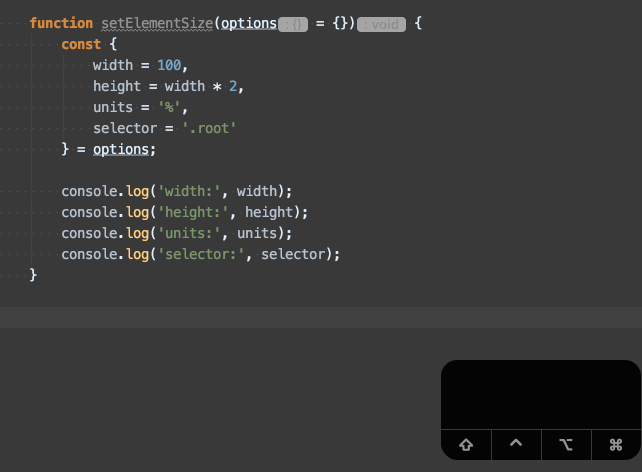
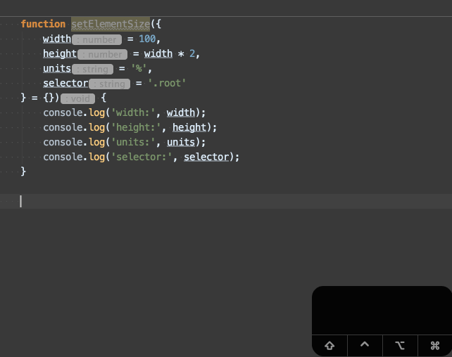

# Параметры функции по умолчанию

В JS параметры функции которые не были преданы при её вызове будут проинициализированы значениям `undefined`

```javascript
function hi(first, last) {
  console.log('first', first);
  console.log('last', last);
}

hi('John');
// first John
// last undefined
```

До появления ES2015 (ECMAScript 6) для задания параметров по умолчанию использовался прием с применением логического оператора "или" `||`

```javascript
function setElementSize (width, height) {
  const newWidth = width || 50;
  const newHeight = height || 100;

  console.log('newWidth:', newWidth);
  console.log('newHeight:', newWidth);
}
```

Таким образом при вызове функции `setElementSize` без аргументов, будут возвращены значения по умолчанию:

```javascript
setElementSize();
// newWidth: 50
// newHeight: 100
```

С приходом ES2015 (ECMAScript 6) появилась возможно использовать параметры по умолчанию непосредственно в аргументах функий:

```javascript
function setElementSize (width = 50, height = 100) {
  /* logic ... */
}
```

Что добавило таким функциям локаничности и простоты восприятия при чтении кода.

## Использование параметров по умолчанию в следующих параметрах по умолчанию

В параметрах по умолчанию можно использовать значения предыдущих параметров по умолчанию, которые расположены левее от текущего параметра:

```javascript
function setElementSize (width = 50, height = width * 2) {
  console.log('newWidth:', newWidth);
  console.log('newHeight:', newWidth);
}

setElementSize();
// newWidth: 50
// newHeight: 100
```

## Использование параметров по умолчанию вместе с деструктурирующим присваиванием

Когда в функцию необходимо передать 3 и более параметров, в большинстве случаев, хорошей практикой считается отказаться от передачи параметров в виде отдельных аргументов и рекомендуется заменить их на объект с соответствующими значениями.

**Основная причина** - при большом количестве аргументов (более 3х) становится сложно запоминать и управлять порядком аргументов.

```javascript
function setElementSize(width, height, units, selector) { /* logic... */ }

setElementSize(100, 200, 'px', '.some-class');
```

Даже при достаточной поддержке со стороны IDE, есть шанс перепутать местами порядок каких-то аргументов и получить очень неожиданное поведение функции

Чтобы защитить пользователей функции от такой гипотетической ошибки, стоит заменить аргументы функции на объект:

```javascript
function setElementSize(options = {}) {
  console.log('width:', options.width);
  console.log('height:', options.height);
  console.log('units:', options.units);
  console.log('selector:', options.selector);
}
```

Теперь при вызове `setElementSize` не имеет никакого значения в каком порядке мы передадим параметры внутри объекта:

```javascript
setElementSize({ height: 20, units: '%', width: 30, selector: 'root'});
// width: 30
// height: 20
// units: '%'
// selector: 'root'
```

Но теперь остается открытым вопрос использования параметров по умолчанию. Давайте закроем этот вопрос воспользовавшись
деструктурирующим присваиванием:

```javascript
function setElementSize(options = {}) {
  const {
    width = 100,
    height = width * 2,
    units = '%',
    selector = '.root'
  } = options;

  console.log('width:', width);
  console.log('height:', height);
  console.log('units:', units);
  console.log('selector:', selector);
}

setElementSize({units: 'px', selector: '.header'});

// width: 100
// height: 200
// units: 'px'
// selector: '.header'
```

Но давайте пойдем еще дальше и используем прием деструктурирующего присваивания в аргументах функции:

```javascript
function setElementSize({
  width = 100,
  height = width * 2,
  units = '%',
  selector = '.root'
} = {}) {
  console.log('width:', width);
  console.log('height:', height);
  console.log('units:', units);
  console.log('selector:', selector);
}

setElementSize({units: 'px', selector: 'root'});

// width: 100
// height: 200
// units: 'px'
// selector: '.header'
```

Таким образом мы
* избавились от лишнего объявления переменных через `const` в теле функции и аргумента `options`
* получили дополнительный бонус в виде подсказки синтаксиса в "WebStorm" IDE в виде "hints" и "quick documentation" (в VSCode тоже будет работать)

### Дефолтные параметры внутри тела функции

Обратите внимание что при объявлении дефолтных параметров в теле функции, подсказка в IDE
не понимает из каких параметров состоит объект `options`



### Дефолтные параметры функции с деструктурирующим присваиванием в аргументах

При использовании дефолтных параметров с деструктурирующим присваиванием в аргументах, IDE
корректно подсвечивает поля из которых состоит объект `options` и их дефотных значений


