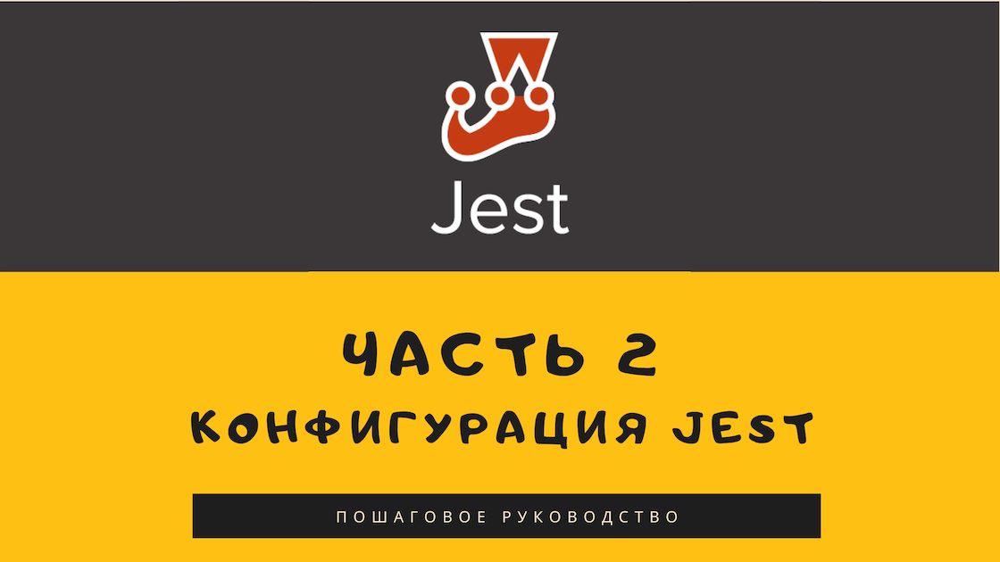
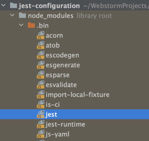
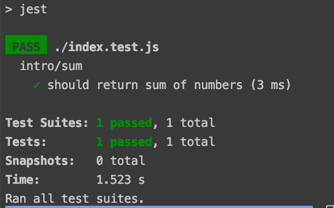

# Конфигурация Jest



## Инициализация проекта

Конфигурировать "Jest" будем на примере нового проекта.

Давайте создадим директорию `jest-project`. Сделать это можно командой:

```
mkdir jest-project
```

Либо любым другим удобным вам способом.

Далее нам понадобится проинициализировать наш проект с помощью пакетного
менеджера `npm`

> На данный момент у вас должен быть установлен Node.js + npm.
> Если вы еще этого не сделали, то вам [сюда](https://nodejs.org).
> При установке Node.js npm будет установлен автоматически

Инициализируем наш проект выполним следующую команду в корне проекта:

```
npm init --yes
```

Данная команда создаст два файла "package.json" и "package-lock.json".

Файл "package.json" понадобится нам для добавления npm-пакетов из реестра npm,
таких, к примеру, как "jest", в наш проект.

А "package-lock.json" будет следить за версиями пакетов и их зависимостями.


Флаг `--yes` означает что мы отвечаем "да", на все вопросы, которые
`npm` задаст нам в процессе инициализации.

Результатом выполнения данной команды может быть следующий вывод:

```json
{
  "name": "jest-configuration",
  "version": "1.0.0",
  "description": "",
  "main": "index.js",
  "scripts": {
    "test": "echo \"Error: no test specified\" && exit 1"
  },
  "keywords": [],
  "author": "",
  "license": "ISC"
}
```

Далее нам нужно установить "jest":

```
npm install jest --save-dev
```

Данную команду можно сократить:

```
npm i jest --save-dev
```

Где `i` это алиас или псевдоним команды `install`.

А флаг `--save-dev` означает что данный пакет будет установлен как зависимость необходимая для
разработки или другими словами исходный код данного модуля не будет использоваться конечными пользователями
нашего проекта.

После установки "Jest" наш "package.json" будет выглядеть следующим образом:

```json
{
  "name": "jest-configuration",
  "version": "1.0.0",
  "description": "",
  "main": "index.js",
  "scripts": {
    "test": "echo \"Error: no test specified\" && exit 1"
  },
  "keywords": [],
  "author": "",
  "license": "ISC",
  "devDependencies": { // highlight-line
    "jest": "^26.1.0"  // highlight-line
  }                    // highlight-line
}
```

Появилась новая секция `devDependencies` куда и был добавлен "Jest".
Обратите внимание что пакеты добавляются в файл в следующем формате:
"<имя-пакета>": "<версия>"

Подробнее про версионирование пакетов в npm и значения символов `^`, `~` можно почитать
[тут](https://docs.npmjs.com/about-semantic-versioning).

Про семантическое версионирование можно посмотреть вот этот [материал](https://semver.org/lang/ru/)

## Инициализация Jest

Теперь мы готовы проинициализировать сам "Jest".
Делать мы будем это с помощью команды:

```
./node_modules/.bin/jest --init
```

`./node_modules/.bin/jest` - это ссылка на исполняемый файл "Jest", который находится в директории ".bin" 
внутри наших "node_modules", а флаг `--init` говорит от том что мы хотим проинициализировать конфигурацию "Jest".



После запуска данной команды "Jest" попросит нас в консоли ответить на ряд вопросов.
На все вопросы, кроме **"Choose the test environment that will be used for testing"** нужно выбрать
ответ по умолчанию или попросту нажать клавишу "enter"

Так как мы собираемся тестировать UI компоненты, при ответе на вопрос
**"Choose the test environment that will be used for testing"** нужно выбрать: 

- [x] jsdom (browser-like)

После всех проделанных манипуляций "Jest" сгенерирует для нас файл "jest.config.js".

Загляните в этот файл - в нем содержатся комментарии к параметрам "Jest", которые можно сконфигурировать.
За более детальной информацией можно обратиться к [документации](https://jestjs.io/docs/en/configuration)

## Первый "тестовый тест" на Jest

Итак, мы подготовили все для дальнейшей работы с тестами. 
Некоторые дополнительные конфигурации мы выполним чуть позже, а пока давайте создадим нашу 
первую функцию и тест к ней.

Для этого в корне проекта создадим два файла:

* sum.js - реализация функции `sum`
* sum.spec.js - тест или в данном случае спецификация к функционалу `sum`
 
Функция `sum` выполняет очень простую задачу - суммирует два числа: 

```javascript
// Файл "sum.js" 
export default function sum(m, n) {
  return m + n;
}
```

А вот и тест для проверки реализации данной функции. 
Обратите внимание на то что он заканчивается на "*.spec.js". 

```javascript
// Файл "sum.spec.js"
import sum from './index.js';

describe('intro/sum', () => {
  it('should return sum of numbers', () => {
    expect(sum(1, 1)).toEqual(2);
  });
});
```

Причины на это две:

1. "Jest" распознает файлы тестов по расширению файлов или суффиксу, в данном случае мы используем "spec.js"
2. Суффикс "spec" явно подчеркиваем мысль что наш тест является
спецификацией для функции `sum.js`. 

---
> **⚠️ Обратите внимание!**
>  
> "Jest" автоматически распознает файлы, имена которые заканчиваются на `*.spec.js` 
> или `*.test.js`. Подробнее об этом можно почитать 
> [тут](https://jestjs.io/docs/en/configuration#testmatch-arraystring)
---

Теперь давайте попробуем запустить наш тест. 

Делать мы будем с помощью npm.
Для этого нам необходимо добавить в файл "package.json" следующую строку в секцию `scripts`:

```json
{
  "name": "jest-configuration",
  "version": "1.0.0",
  "description": "",
  "main": "index.js",
  "scripts": {
    "test": "jest" // highlight-line
  },
  "keywords": [],
  "author": "",
  "license": "ISC",
  "devDependencies": { 
    "jest": "^26.1.0"
  }
}
```

После чего в консоли вызовем команду:

```
npm run test
```

Данный вызов выведет в консоль целую простыню рекомендаций и уточнений, а именно:

```
> jest-configuration@1.0.0 test /jest-configuration
> jest

 FAIL  ./index.test.js
  ● Test suite failed to run

    Jest encountered an unexpected token

    This usually means that you are trying to import a file which Jest cannot parse, e.g. it's not plain JavaScript.

    By default, if Jest sees a Babel config, it will use that to transform your files, ignoring "node_modules".

    Here's what you can do:
     • To have some of your "node_modules" files transformed, you can specify a custom "transformIgnorePatterns" in your config.
     • If you need a custom transformation specify a "transform" option in your config.
     • If you simply want to mock your non-JS modules (e.g. binary assets) you can stub them out with the "moduleNameMapper" config option.

    You'll find more details and examples of these config options in the docs:
    https://jestjs.io/docs/en/configuration.html

    Details:

    /jest-configuration/index.test.js:1
    import sum from './index.js';
    ^^^^^^

    SyntaxError: Cannot use import statement outside a module

```

"Jest" заботливо сообщает нам о том что мы использовали `import` и он не знает что с ним делать: 

> This usually means that you are trying to import a file which Jest cannot parse, e.g. it's not plain JavaScript.

А также подсказывает, что если в проекте используется конфиг ["Babel"](https://babeljs.io/), "Jest" будет использовать его
для работы с `import`

## Добавляем Babel

Теперь осталось добавить "Babel" в нашу конфигурацию для поддержки `import` и прочих современных
возможностей JavaScript внутри наших тестов.

Давайте установим следующие зависимости:

```
npm install @babel/core @babel/cli --save-dev
```

Данная команда добавит два пакета:

* Пакет `@babel/cli` обеспечивает возможность работы с Babel через терминал. 
  Предоставляет командную утилиту Babel. 
  
* Пакет `@babel/core` содержит код, который выполняет всю работу по транспиляции, 
  но не содержит внутри себя правил преобразования. 
  Правила описаны в отдельных пакетах, называемых плагинами.
  
```json
{
  "name": "jest-configuration",
  "version": "1.0.0",
  "description": "",
  "main": "index.js",
  "scripts": {
    "test": "jest"
  },
  "keywords": [],
  "author": "",
  "license": "ISC",
  "devDependencies": {
    "@babel/cli": "^7.10.5", // highlight-line
    "@babel/core": "^7.11.0", // highlight-line
    "jest": "^26.1.0"
  }
}
```

Теперь осталось подружить "Jest" и "Babel". Для этого нам понадобится создать конфигурационный
файл ".babelrc" о котором ранее сообщалось в информационном выводе от "Jest" при попытке запуска тестов.

А также добавить некоторые плагины... 

Давайте сделаем это.

Создаем файл ".babelrc"

```javascript
module.exports = {
  presets: [
    ['@babel/preset-env']
  ]
};
```
В массиве "presets" мы указали всего один пресет [@babel/preset-env](https://babeljs.io/docs/en/babel-preset-env).

Пресет - это набор плагинов. В нашем случае данный пресет включает преобразование кода ES2015+, в 
том числе и `import`.

Устанавливаем пресет "@babel/preset-env":

```
npm install @babel/preset-env --save-dev
```

Теперь все готово к запуску тестов.

Выполняем команду:

```
npm run test
```

И получаем следующий вывод, который сообщает что все тесты
были выполнены успешно.



На этом базовая конфигурация "Jest" закончена, конечно, осталась масса тонкостей и нюансов,
связанных с настройкой окружения для тестирования, но об этом поговорим в следующем посте.
