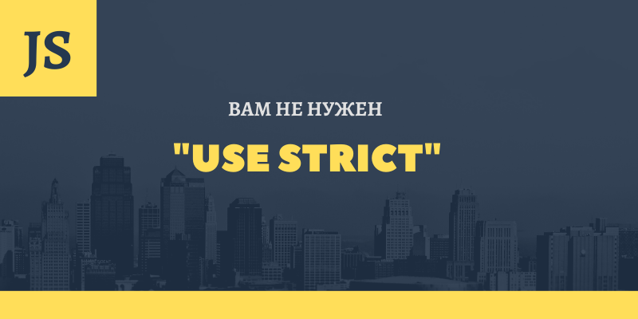

---
title: 'Директива "use strict"'
tags: ["javascript", "use-strict"]
published: true
date: '2021-12-22'
logo: 'logo-use-strict.png'
---  

# Директива "use strict"



`"use strict"` - це директива, яка була додана до JavaScript у стандарті ["ECMAScript 5th Edition (ES5)"](https://www.ecma-international.org/publications/files/ECMA-ST-ARCH/ECMA-262%205th%20edition%20December%202009.pdf)

> Список всіх стандартів JavaScript доступний за цим [посиланням.](https://www.ecma-international.org/publications/standards/Ecma-262-arch.htm)

Її мета - повідомити інтерпритатору що код, який слідує за нею, треба обробити в "строгому режимі".

Строгий режим працює наступним чином:

* **виправляє** деякі **недоліки JavaScript**
* **забороняє** використовувати **деякі елементи синтаксису**
* **забезпечує** більш **сувору перевірку** на наявність помилок

Строгий режим можна увімкнути як для всього тегу `<script>` або файлу,

```html
<script>
  'use strict';

  // Увімкнули строгий режим для всього тега скрипт
</script>
```

так і для окремої функції за допомогою директиви `"use strict"'

```javascript
// Звичайний режим тут

function mySuperFoo () {
  'use strict';

  // Строгий режим тут
}

// Звичайний режим тут
```

**Важливо:** Директива `"use strict"` повинна знаходитися на початку (на першому рядку, що виконується)
файлу або тегу `<script>`, або на першому рядку функції, що виконується.

Давайте подивимося, чим строгий режим відрізняється від звичайного режиму.

## У строгому режимі не можна створити глобальну змінну

У строгому режимі не можна створити глобальну змінну, або іншими словами, змінну
без використання ключових слів `var`, `let` або `const`.

```javascript
'use strict'

myLonelyVariable = 1; // Uncaught ReferenceError: myLonelyVariable is not defined
```

Таке оголошення в строгому режимі кине помилку **"Uncaught ReferenceError"**.
У звичайному режимі, не строгому, така спроба створить нову глобальну змінну 
і додасть її як властивості в глобальний об'єкт.

## У строгому режимі функції не отримують посилання на глобальний об'єкт як значення `this`

У строгому режимі, функції що викликаються як функції, а не як методи об'єктів,
отримають `undefined` як значення `this`

```javascript
'use strict'

function getName () {
  console.log(this);
}

getName(); // undefined
```

Більш того, в строгому режимі, значення `this` завжди відповідає значенню, переданому як контекст виконання в
методах `call`, `apply` та `bind`

```javascript
'use strict'

function getName () {
  console.log(this);
}

getName.call(undefined); // undefined
getName.apply(null); // null
getName.bind()(); // undefined
```

А в несуворому режимі `null` та `undefined` будуть замінені посиланням на глобальний об'єкт.

```javascript
function getName () {
  console.log(this);
}

getName.call(undefined); // Window
getName.apply(null); // Window
getName.bind()(); // Window
```

## У строгому режимі функціональні вирази видно лише всередині блоку

У строгому режимі функціональні вирази (Function Declaration) видно лише всередині блоку,
в якому оголошено, тому в прикладі нижче ми отримаємо помилку **`ReferenceError`**

```javascript
'use strict'

if (true) {
  function hi() {
    console.error('hi 👋');
  }
}

hi(); // Uncaught ReferenceError: hi is not defined
```

Без `"use strict"` ми побачили би у консолі "hi 👋"

## В строгом режиме нельзя присвоить значения свойствам, которые недоступны для записи

У строгому режимі не можна надати значення властивостям, які недоступні для запису, або
створити властивості в нерозширюваних об'єктах

```javascript
'use strict'

Infinity = 1; // Uncaught TypeError: Cannot assign to read only property 'Infinity' of object '#<Window>'

const obj = {};
const frozenObj = Object.freeze(obj);

frozenObj.newProp = 1; // Uncaught TypeError: Cannot add property newProp, object is not extensible
``` 

В обох випадках у строгому режимі такі операції викличуть помилку **TypeError**, 
а у звичайному режимі таке присвоєння просто буде проігноровано.

## У строгому режимі псевдомасив `arguments` зберігає статичну копію значень

У суворому режимі псевдомасив `arguments` зберігає статичну копію значень аргументів, переданих у функцію.

```javascript{numberLines: true}
'use strict'
// highlight-range{4}
function foo(x) {
  console.log(x === arguments[0]); // true

  arguments[0] = 2;

  console.log(x === arguments[0]); // false 
  console.log(x); // 1 
}

foo(1);
```

У прикладі вище у рядку **5** ми перевизначили значення `arguments[0]`, причому значення `x` не змінилося.

У звичайному режимі, не строгому, елементи `arguments` та іменовані параметри функції посилаються на ті самі значення,
тому перевизначення торкнулося б значення `x`.

У строгому режимі визначення двох або більше параметрів з однаковими
іменами в оголошенні функції є синтаксичною помилкою. 

```javascript
'use strict'

function foo(x, x) {
  console.error('x', x);
  console.error('x', x);
}

foo(1, 2);
```

У звичайному режимі, помилка не виникає.

## Менш значущі особливості роботи строгого режиму 

* У строгому режимі не можна використовувати конструкцію `with`.
Якщо ви не чули про неї, то, можливо, вже і не варто про
неї турбуватися, але на всякий випадок залишу [посилання](https://developer.mozilla.org/ru/docs/Web/JavaScript/Reference/Statements/with)

* Також у строгому режимі усунуті деякі моменти, пов'язані з поведінкою методу `eval`.
Без `"use strict"` у `eval` не буде свого лексичного оточення, тому змінні, 
оголошені всередині `eval`, можуть перевизначити змінні лексичного оточення батьківської функції.

* У строгому режимі властивості `arguments.callee` та `arguments.callee.caller` більше не підтримуються

* У строгому режимі заборонено використовувати такі зарезервовані слова: 
`implements`, `let`, `interface`, `package`, `private`, `protected`, `public`, `static`, `yield`

## Висновок

Всі ці особливості роботи строгого та звичайного режимів важливі для розуміння тонкощів мови
JavaScript, але на практиці, в більшості випадків, ми працюємо з **класами** та **модулями**, а **у них
строгий режим увімкнено за замовчуванням**.
